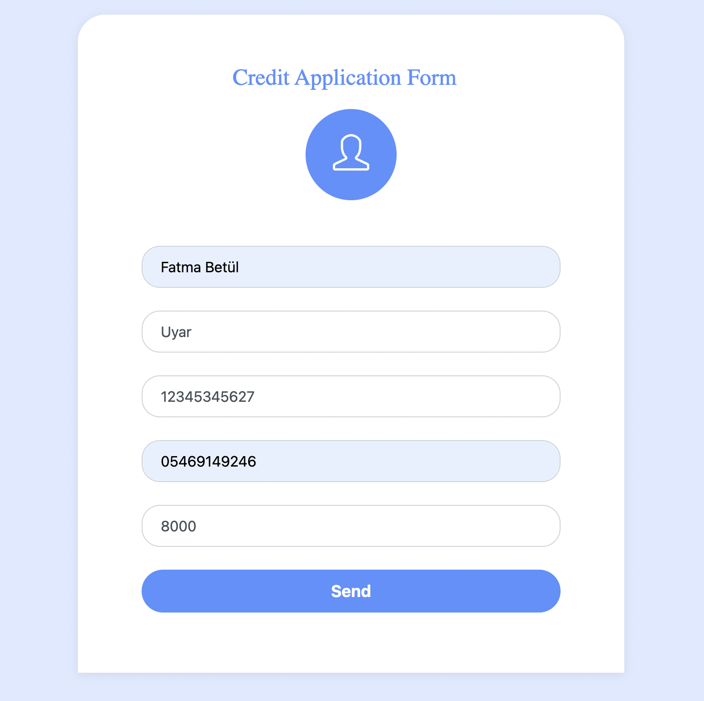
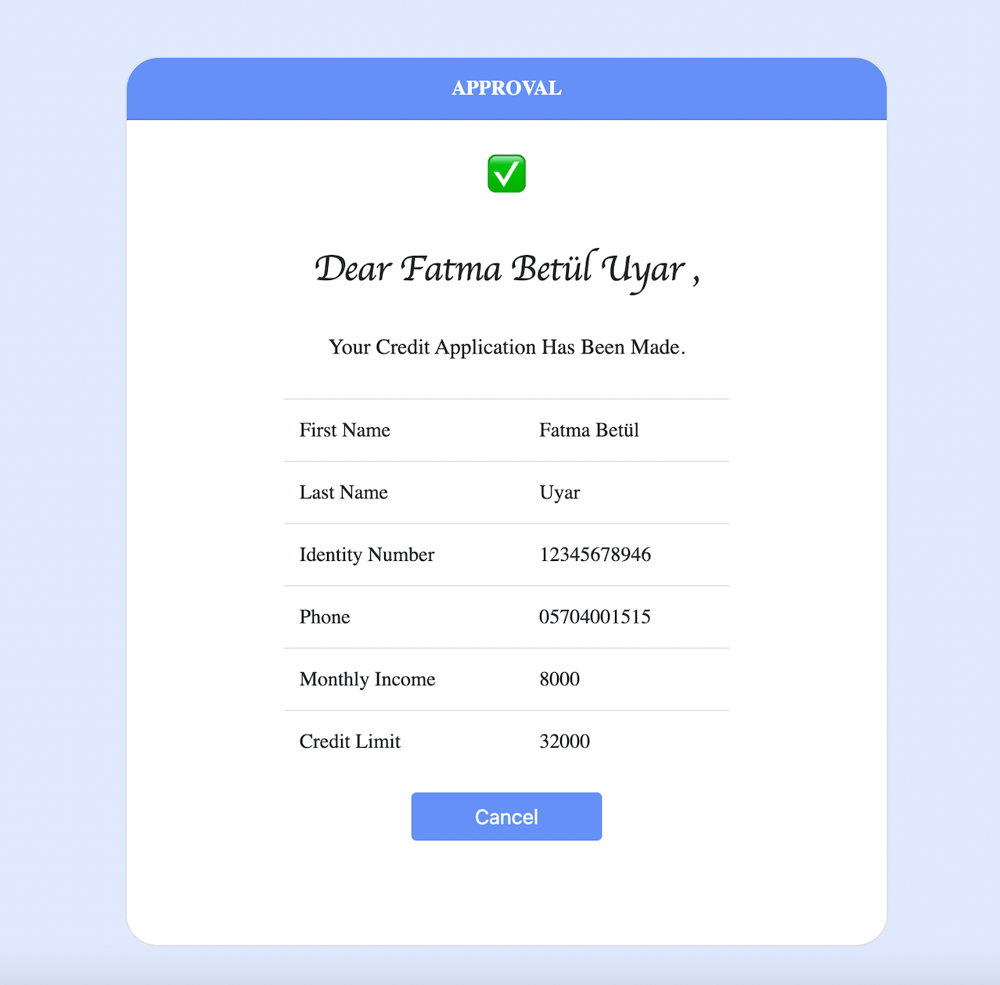
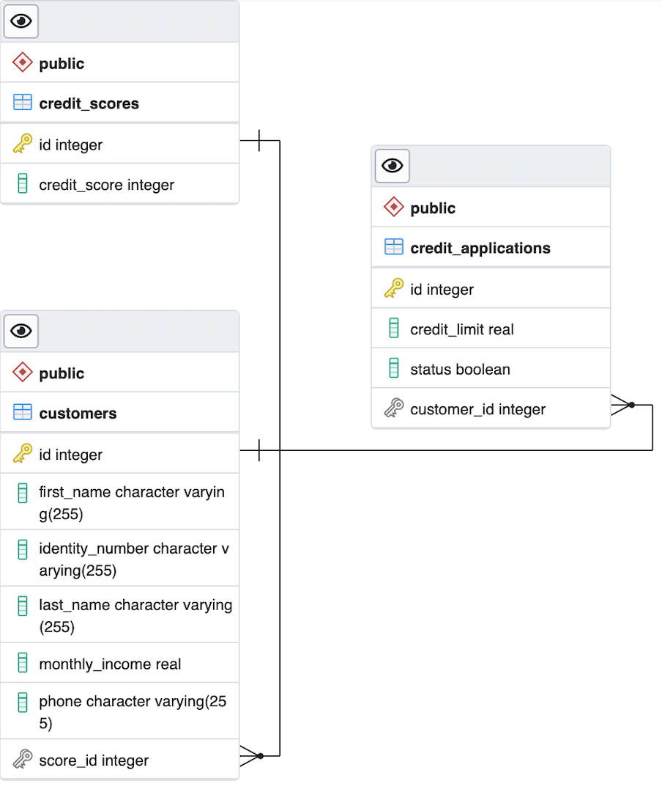
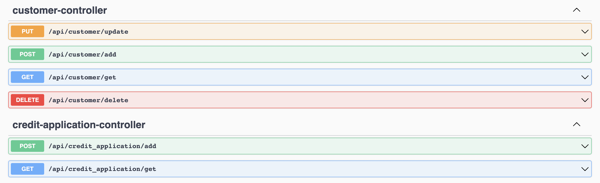

<h2>PATİKA.DEV - PAYCORE JAVA SPRİNG BOOTCAMP GRADUATION PROJECT</h2> 

This graduation project is a Credit System Project.

<h3>📚 SUBJECT OF PROJECT </h3>

Writing a <b>Restful Application</b> for a credit application system, which will take the credit application requests and return the loan result to the customer according to the relevant criteria, using the  <b>Spring Boot framework </b> and optionally writing the frontend

<h4>✏️ APPLICATION FORM & RESULT </h4>

<h4>📝  UML DIAGRAM</h4> 

<h4>📝 DATABASE DIAGRAM</h4> 

<h4>📝 REQUİREMENTS</h4>
<ol>
<li>The user's <b>identity number, name-surname, monthly income and telephone </b> information are obtained,  
(There may be two options as <b>✅ Approval</b> or <b>❌ Rejection</b>.) </li>
<li> The <b>credit score service</b> is assumed to be written with the identity number before, and the credit score of the relevant person is obtained</li>
<li>And the credit result is shown to the user according to the following rules.</li>
<ul>
<li>
<b>New users</b> can be <b>defined</b>  in the system, existing customers can be <b>updated</b> or <b>deleted</b>.</li>
<li>If the <b>credit score</b>  is <b>below 500</b>, the user will be rejected. <b>(Credit result: Reject ❌ )</b></li>
<li>If the <b>credit score</b> is <b>between 500</b> points and <b>1000</b> points<ul><li> And if the <b>monthly income</b>  is <b>below 5000 </b> TL  
The user's loan application is approved and a <b>limit of 10,000 TL</b>  is assigned to the user. <b>(Credit Result:
Approval ✅ )</b>
</li></ul></li>
<li>
If the <b>credit score</b>  is <b>between 500</b> points and <b>1000 </b>points <ul><li>And if the <b>monthly income</b> is <b>above 5000 </b>TL 
The loan application of the user is approved and a <b>limit of 20.000 TL</b>   is assigned to the user.<b>(Credit Result:
Approval ✅ )</b> 
</li>
</ul></li>
<li>
If the <b>credit score</b>  is <b>equal</b> to or <b>above 1000</b>  points, the user will receive <b> Monthly Income * Credit Limit Multiplier</b>
The limit is assigned as much as the LIMIT MULTIPLIER. <b>(Credit Result:
Approval ✅ )</b>   (The credit limit multiplier is 4 by default.) </li>
</ul>
<li>As a result of the conclusion of the loan, the relevant <b>application</b> is <b>recorded</b> in the <b>database</b> .</li>
<li>Later
by <b>sending a notification SMS</b> to the relevant phone number, confirmation <b> status </b>information and <b>limit </b>information are <b>returned</b> from the endpoint.</li>
<li>A completed loan application <b>can only be queried</b> with an <b>Identity number.</b> </li>
</ol>

<h4>📝 BUILD WITH</h4>

<h4>📝 TECHNOLOGIES </h4>
<ul>
<li><b>Spring Boot</b></li>
<li>
<b>API Documentation</b> ➡️ <b>Swagger UI</b>

I included Swagger in my project because its purpose is to provide an interface for RestApi's.

</li>
<li>
<b>ORM</b> ➡️ <b>JPA/Hibernate</b>

Hibernate doesn't just convert from Java classes to database tables or from Java data types to SQL data types. Hibernate also provides data query and data retriaval operations for the user. With these features, Hibernate provides ease of development and saves time.So I used Hibernate.
</li>
<li>
<b>Build Tool</b> ➡️ <b>Maven</b> 

I used Maven because it provides easy tracking of projects thanks to the standard file-directory structure it provides.

</li>
<li>
<b>Unıt Test</b> ➡️ <b>Junit</b>

Junıt simplifies testing and shortens this time by offering a variety of additional features.That's why I added it to my project.
</li>
<li><b>Lombok</b>
I used Lombok when developing Java applications because it is a code generation library with the help of annotation that allows us to write less and cleaner code, facilitate readability
</li>
<li><b>React JS</b>

I used ReactJs because it is a very powerful framework with its flexible structure, re-usable components and state management.</li>
<li><b>Bootstrap</b>
I used it for convenience for design
</li>
<li><b>Axios</b>
I used it to pull data from API
</li>
</ul>
<h4>📝 ENDPOINTS </h4>

<h4>📝 ARCHITECTURE </h4>
